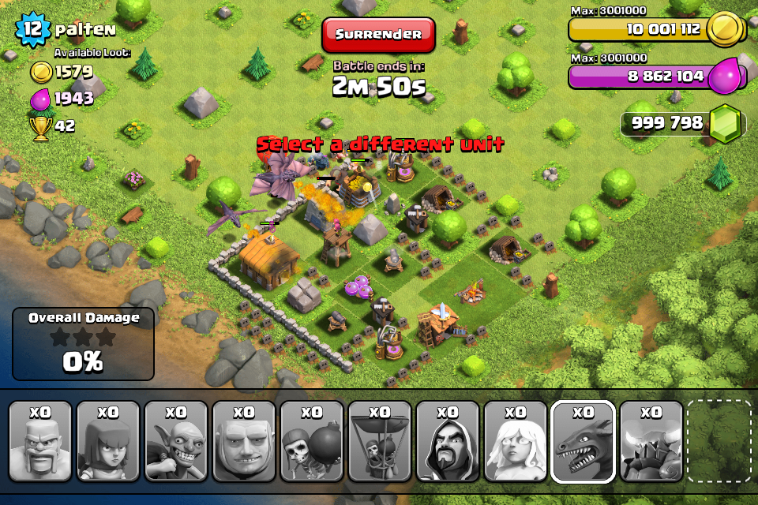
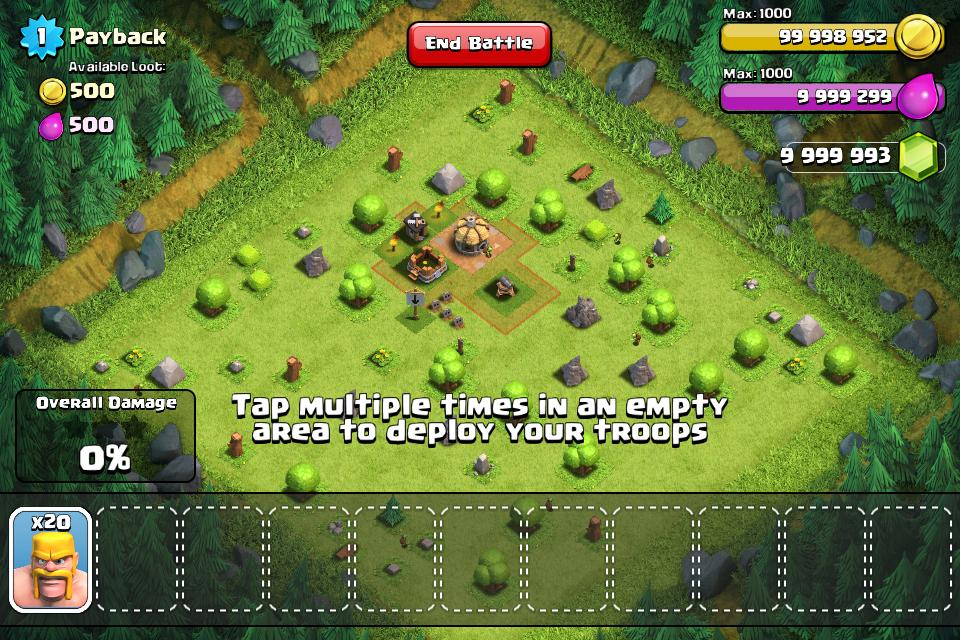
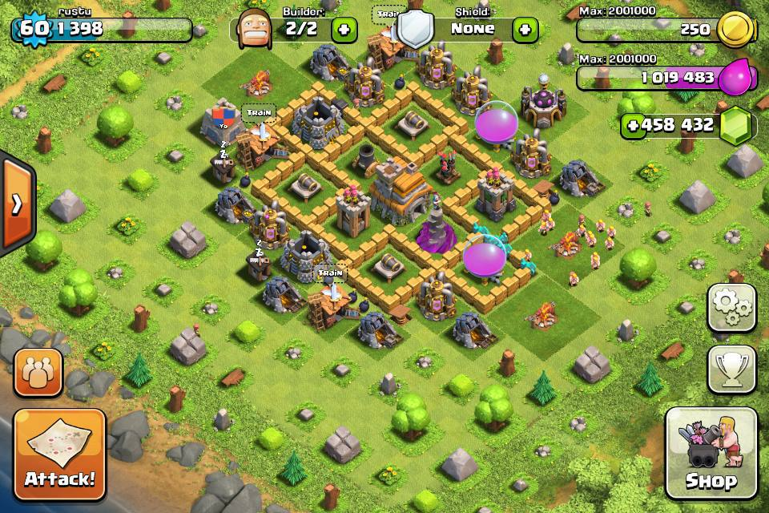
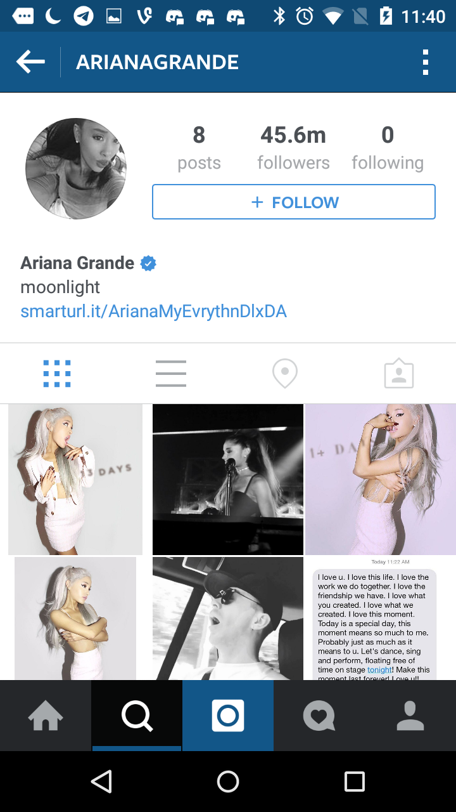
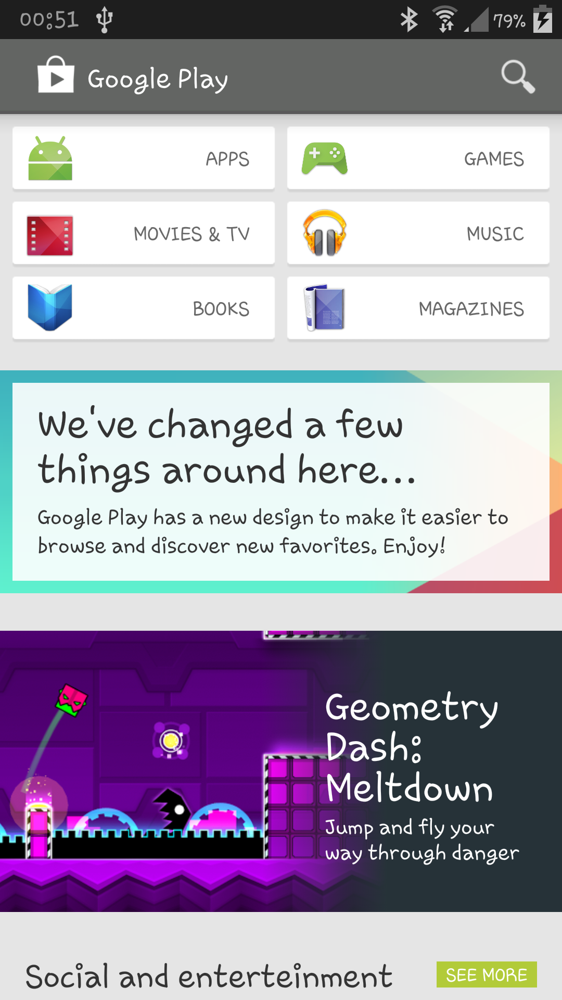
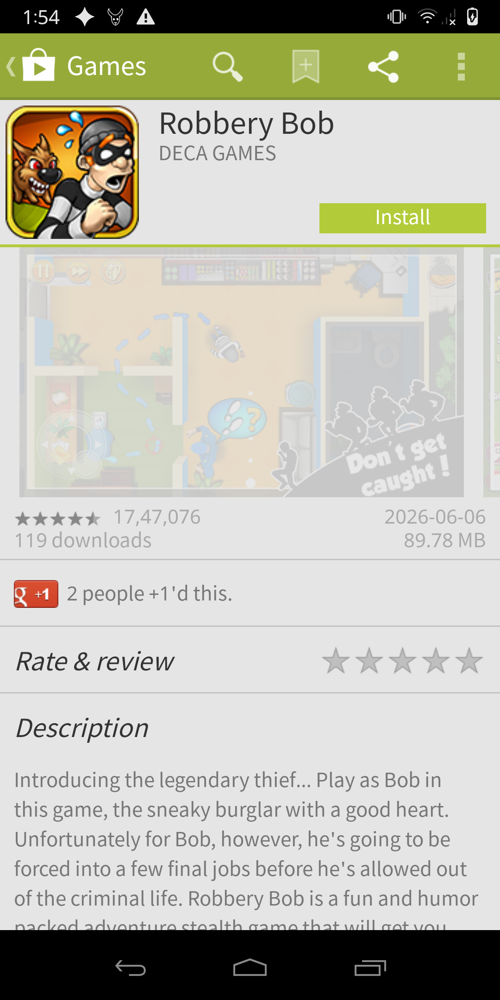
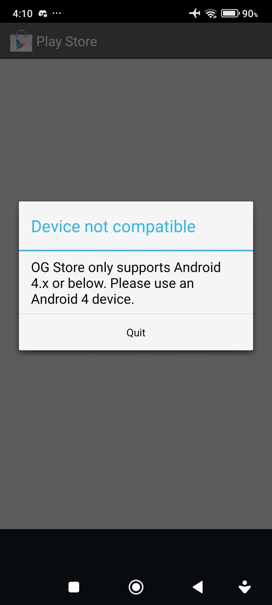

<h1 align="center">hey i am scorp / russhty</h1>

<h3 align="center">Python dev</h3>

  

<h3> 🛰️ Currently working on: </h3>

<ul>
  <li>
    
    <a href="https://retroclash.it"><b>retroclash.it</b></a>
    — a Clash of Clans v1.70 private server, full protocol was rewritten and every message/command id implemented, making the online game fully functional in 2026
     
    
    
    

      
📸 See screenshots

       
      
      
      
    

  </li>
   
  <li>
    
    <a href="https://retrogram.it"><b>retrogram.it</b></a>
    — same as coc, revival of the Instagram 6.20.4 (2015 era) protocol, fully patched with the backend rewritten in python lol
     
    
    
    

      
📸 See screenshots

       
      
      
      
    

  </li>
   
  <li>
    
    <a href="https://googleplaystore.it"><b>googleplaystore.it</b></a>
    — yet another revival, this time of the (g)old Google Play Store 4.0.25 (2013 era, right after Android Market), fully patched with the backend rewritten in python
     
    
    
    

      
📸 See screenshots

       
      
      
      
    

  </li>
</ul>

<h3 align="left">Contact me:</h3>

  

  

archived = patched

<h3 align="left">Languages and Tools:</h3>

  

  

  

  

  

  

  

  

  

  

